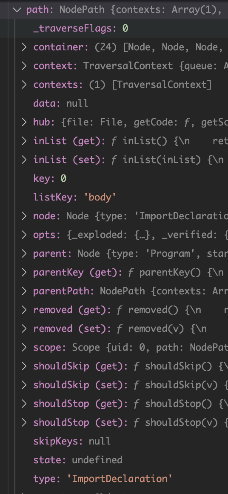
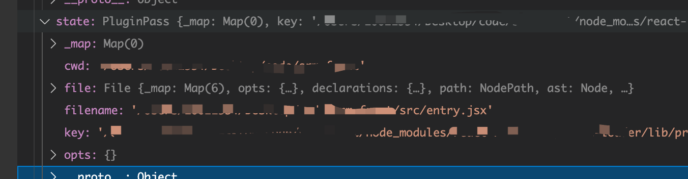
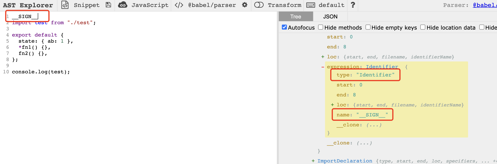

# Babel

Babel 是一个通用的多功能的 JavaScript 编译器。此外它还拥有众多模块可用于不同形式的静态分析。

静态分析是在不需要执行代码的前提下对代码进行分析的处理过程 （执行代码的同时进行代码分析即是动态分析）。 静态分析的目的是多种多样的， 它可用于语法检查，编译，代码高亮，代码转换，优化，压缩等等场景。

babel 在处理代码时经历的过程:
1、解析（parse）。将源代码变成 AST。
2、转换（transform）。操作 AST，这也是我们可以操作的部分，去改变代码。
3、生成（generate）。将更改后的 AST，再变回代码。

我们写 Babel 插件的时候，最重要的就是要定义一个 visitor 对象。 这是因为 Babel 插件的设计遵循访问者（Visitor）模式。什么是访问者模式呢？简单来说，访问者模式是能把处理方法从数据结构中分离出来的一种模式，这种模式的好处就是可以根据需求增加新的处理方法，且不用修改原来的程序代码与数据结构，而处理方法都是内部具体实现了，是依赖反转原则的反面

## 编写

```
npm i @babel/core
```

使用`babel.transformSync`，两个入参，第一个为 code 字符串，第二个为 options，和.babelrc 一样

[@babel/core](https://www.babeljs.cn/docs/babel-core)

presets 就是一组 plugins 的集合，所以都是插件

在 plugins 里可以引入相对路径的插件地址

```
plugins: ["./babel/index"],
```

插件遵循这样的执行顺序，pre -> visitor -> post，而pre与post只接受一个入参state，以下有对其说明，不能操作ast，而visitor的节点 都有 enter 和 exit 的过程，默认使用 enter 阶段。

```js
module.exports = ({ types: t }) => {
  return {
    pre(state) {
      this.isOp = false;
    },
    post(state) {
      this.isOp = null;
    },
    visitor: {
      BlockStatement: {
        enter(path) {
          console.log(path);
        },
        exit(path) {
          console.log(path);
        }
      },
      ImportDeclaration() {
        console.log("ImportDeclaration");
      },
    },
  }
```

插件参数是个 babel 对象，能拿到`@babel/types`，主要用途是在构建 AST 和检查 AST 节点类型的方法

如：

```js
module.exports = (babel) => {
  const { types } = babel;
  return {
    visitor: {
      ImportDeclaration() {
        console.log("ImportDeclaration");
      },
    },
  };
};
```

[@babel/types 具体 api](https://www.babeljs.cn/docs/babel-types)

而如何生成节点，可以根据辅助工具[AST Explorer](https://astexplorer.net/)还有 api 文档对应的节点入参进行编写

如：


编写插件主要是编写 visitor 对象，即告诉遍历 ast 时要访问哪些类型的代码，以及对这些代码要做的操作。

而想知道 ast 就需要辅助工具进行转换，如[AST Explorer](https://astexplorer.net/)，然后从中获取到对应节点的 type

比如导入的 type`ImportDeclaration`

在访问对应的节点时，接收两个对象 path 与 state

path 是一个节点在树中的位置以及关于该节点各种信息


state 是该 ast 的数据源的数据，如来自哪个文件、执行位置、source、整个 ast 等等


而 babel 插件的编写过程就是个使用辅助工具找到需要操作的节点，然后 visitor 添加此节点进行你想要的操作，如下图




path 上有很多工具方法，如替换节点，查找父节点，查找节点之类的，[详细看文档](https://github.com/jamiebuilds/babel-handbook/blob/master/translations/zh-Hans/plugin-handbook.md)

ast 树的遍历是[深度优先遍历](https://developer.51cto.com/article/614590.html)，而我们常知道的前序中序后序都是深度优先遍历，而 ast 的遍历类似前序遍历，而从文件上看就是从上到下执行，拿到节点后把节点内的所有子节点递归的形式遍历

## 调试

使用vscode生成`launch.json`，node执行修改下`program`执行位置，若npm添加`runtimeExecutable`与`runtimeArgs`

```json
{
  "version": "0.2.0",
  "configurations": [
    {
      "type": "pwa-node",
      "request": "launch",
      "name": "Launch Program",
      "runtimeExecutable": "npm",
      "runtimeArgs": [
        "run",
        "dev"
      ]
    }
  ]
}
```